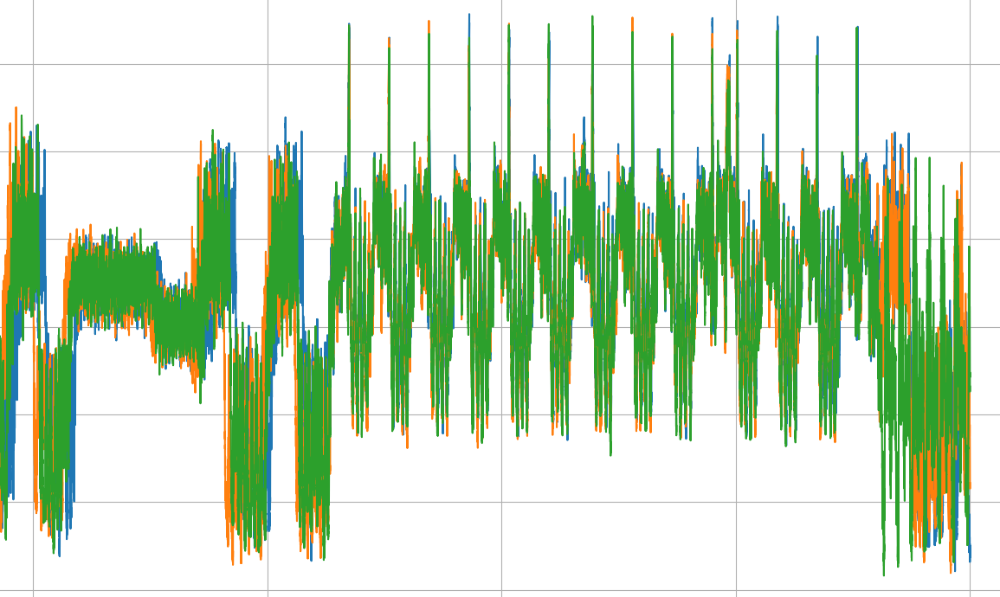

# sparkgap

Sparkgap is a major refactor of my previous side channel and fault injection code. This provides a more consistent UI experience (console instead of paragraph-length command-lines), better self-contained documentation and a single unified support module for both FI and SCA tasks. This toolkit contains:

- cpa.py, wrapper for correlation attacks (AES and DES)
- dpa.py, wrapper for differential attacks
- plot.py, a simple trace visualizer
- preprocessor.py, a signal alignment tool
- capturebuddy.py, wrapper for signal acquisition jobs
  - frontends/*, wrapper scripts for various acquisition frontends
  - drivers/*, wrapper scripts for logic control drivers
- triggerbuddy.py, control script for TriggerBuddy FPGA module
- support/*, a single support package for FI and SCA
- experiments/*, in-progress and successful attacks
- docs/*, self-contained markdown documentation

The code is provided as-is, pull requests welcome :)
