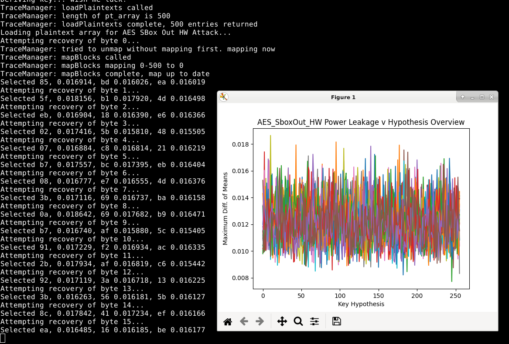
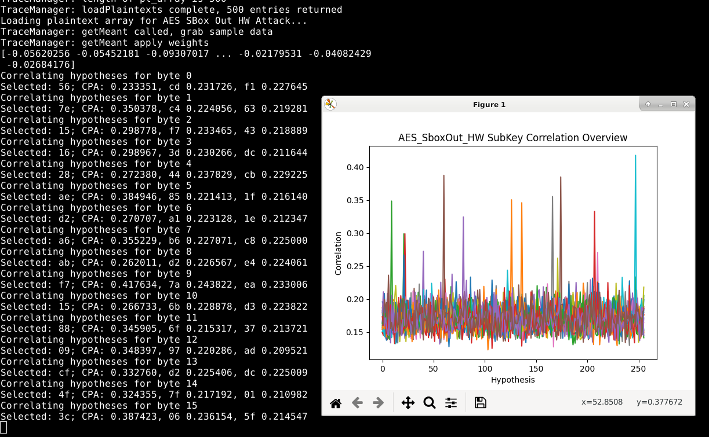

# Noise Simulation

This toolkit has the ability to add varying degrees of misalignment. To use this, use the preprocessing tool, as follows:

    ./preprocessor.py -f ~/source.traces -w ~/dest
    set strategy="earthquake"
    set slidemax=1234
    r
    ...
    q

Note that the slidemax variable is half the "slide window": that is, each trace will be "rolled" (-slidemax) + random.randint(0,slidemax * 2) samples. You can then use various strategies to see how close you can come to realignment. As a test case, I've realigned an AVR AES sample data set with a slidemax of 100. The information extractable out of differential analysis is completely gone, and a CPA is much less effective:

To realign the traces, we can use a one-pass Minimum SAD alignment, against a unique pattern in the first round (pick any). Again, simulating an unknown noise source, we eyeball our SAD cutoff and slide window parameters (500 total SAD, a cutoff).

    ./preprocessor.py -f ~/dest.traces -w ~/dest-realigned.traces
    # note the settings are off, this is just a demonstration of how to align traces
    set ref=0
    set strategy="sad"
    set window_offset=1000
    set window_length=100    
    set window_length=1000
    set window_slide=100
    set sad_cutoff=100
    r

Repeating a CPA attack, peaks appear again:

Note that correlation information for the first key byte is destroyed (in fairness, the original correlation in the raw sample is like 0.26 for first choice vs 0.23 for next), but the remaining key bytes come out nicely.
 
