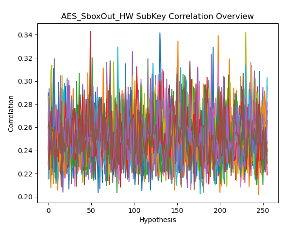
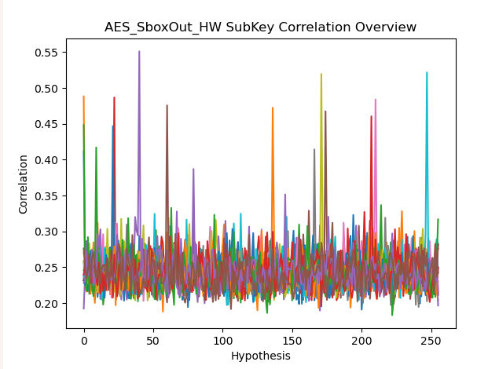

# Signal Preprocessing

The preprocessor.py utility can be used to filter and align traces, and perform a variety of other transforms to trace files before attacks or visualisation. The preprocessor takes 3 arguments:

    ./preprocessor.py -f <source.hdf> -w <new_file.hdf> -c <commandfile.cmd>

The -c argument is optional: if it is present, the preprocessor will execute the commands one by one, then enter a prompt where more commands can be input. If it is not present, the preprocessor will enter a REPL immediately, you can just pipe the command file in I guess.

This is useful for asynchronous captures: for example, if you take a capture of an STM32F2 doing AES using a normal scope, you'll notice there's a little bit of misalignment between samples, and because of this, CPA or DPA attacks are ruined. This is an example CPA, note the lack of strong correlation peaks:

Now, we can use the following preprocessor script:

    set lowpass=(3200000,125000000,1)
    set strategy="lowpass"
    run
    set strategy="sad"
    set corr_cutoff=0.8
    set sad_cutoff=500
    set window_offset=1766
    set window_length=2000
    set window_slide=30
    set clkadjust=0
    set clkadjust_max=0
    set ref=0
    run

This performs two tasks: it first executes a low pass filter over every trace, with a cut off of 32Mhz, a sample rate of 125Mhz and at first order. Then, it will execute a Sum-of-Absolute-Difference alignment from pt 1766 to 3766, sliding 30 samples either way until the minimum difference is reached.

If the length of a clock cycle is known, "clkadjust" can be used to shift entire clock cycles, with the minimum SAD being tested at each clock cycle shift.

Now, running the same CPA produces well defined correlation peaks, correctly identifying the majority of the key:

