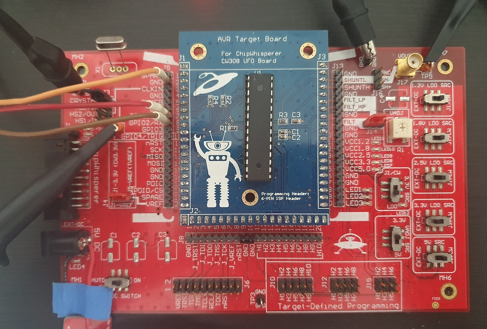
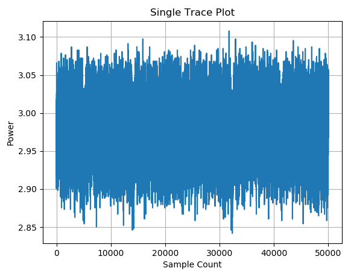
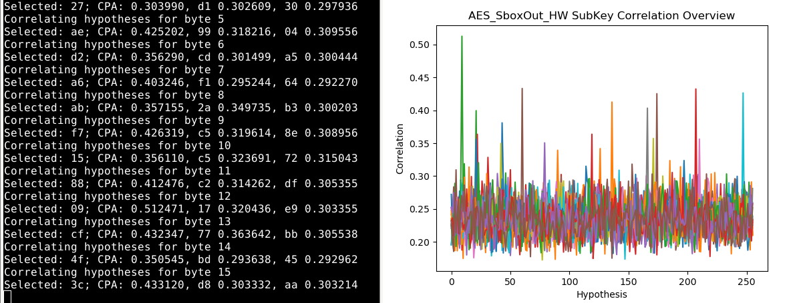

# Quick Start Guide (AVR)

This page documents the process of using this framework to extract an "unknown" cryptographic key from an AES implementation (in targets/avr-target) programmed onto an AVR board, using a Rigol DS1104z scope and an external UART control trigger. For (a lot of) convenience, we use the ChipWhisperer's UFO Target board. This board should be set up as follows:

Note that the RX and TX lines are wired a bit unusually - the "RX" is the host computer's RX line, it is the TX line of the victim. Ensure your clock crystal is mounted appropriately (check the target functions as expected with your serial client of choice).

We must configure the Rigol scope with an IP address, and program this into frontends/rigol.py (TODO: make this a configuration option, fix the init time thing)

We can begin capture with the following commands:

- set tracefile=filename_goes_here
- set samplecount=50000 (enough to capture 1 round at your sample rate)
- set tracecount=250

We can verify the trace works with plot.py, selecting a single trace and applying no filtering (./plot.py -f filename_goes_here -c 1):

We can then use cpa.py to extract the key - in our example, 10000 samples is enough, but you may need to adjust this according to your capture criteria (./cpa.py -f filename_goes_here -a AES_SboxOut_HW -o 0 -n 10000).

The attack is now successfully concluded, with the key recovered with moderately strong correlation coefficients.
