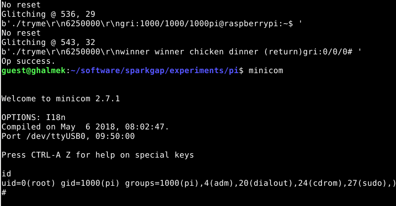

# experiments/pi

This folder contains my experiments against the Raspberry Pi single board computer.

- g2.py contains a working EMFI privilege escalation against Raspberry Pi 3B.
- glitcher.py contains a working VCC FI privilege escalation against a Raspberry Pi 3B+.
- classifier.py is a "glitch finder" tool, which plots successful and failed glitches so you can see what parameters you really need.

The classifier is a fine scrap of duct-tape: it defines "good" crashes as those following the commit_creds code path (i.e. all security checks are bypassed, the system is attempting to commit the creds for the user but fails).

The code is provided as-is: use it at your own risk.
